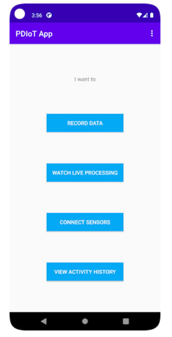
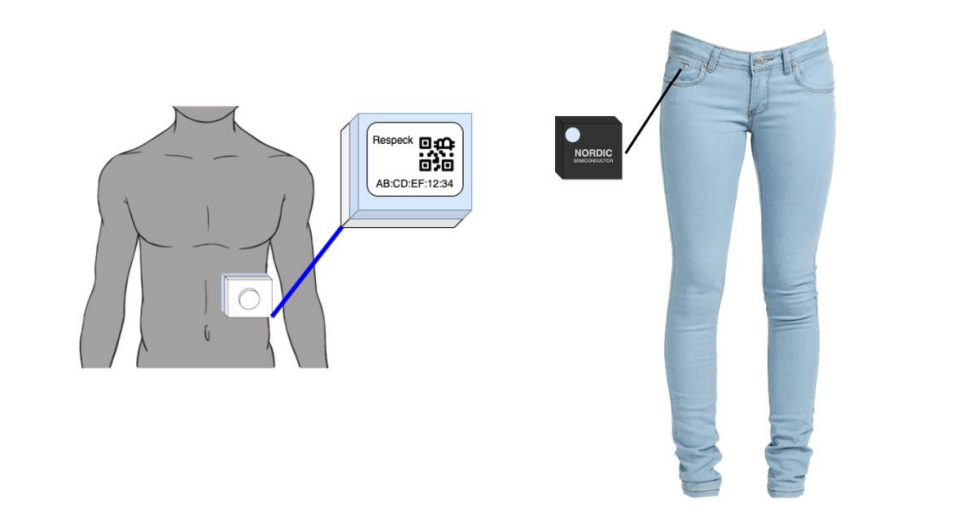
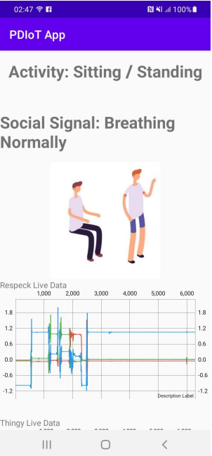

# PDIOT App
An application for the IoT system built for the PDIOT course. This app integrates the sensors with the user, machine learning models, historic data and overall system.

# Setup
Open the PDIOT app, and you should see the home page.

Click on Connect Sensors. Scan the QR code of the Respeck and Thingy sensor or type the code on the App. Make sure to enable and turn on Bluetooth.

Place the sensors on yourself according to the image shown. The Thingy should be placed in the right hand pocket, with the charging point towards the floor and the circle on the top right.
Stick the Respeck sensor onto your skin in the lower left part of your ribcage with the blue side of it on your skin and "Respeck" written upwards.

# Usage
Once the sensors are connected, go back to the home page of the app, and click on watch live processing, you can see live sensor data being displayed on the app along with graphs.
Carry out any of the actions and notice the classification labels being displayed for Activities and Social Signals.

To view historic classification data, go back to the pdiot app home page, click on View Activity History, you can see the durations of each activity that you carried out.
