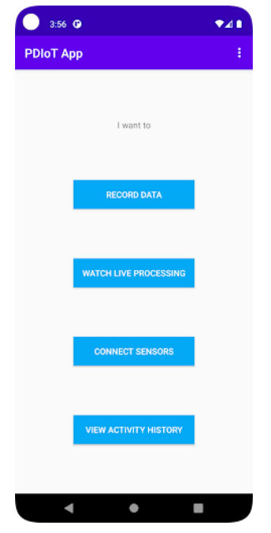
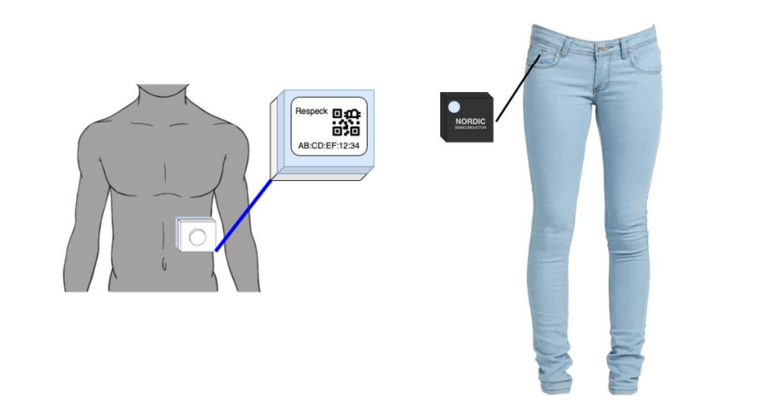
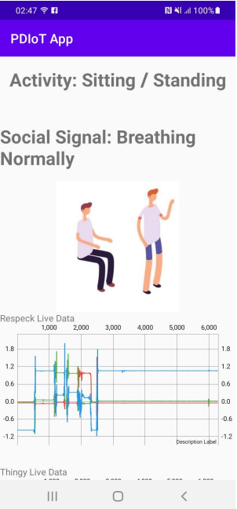
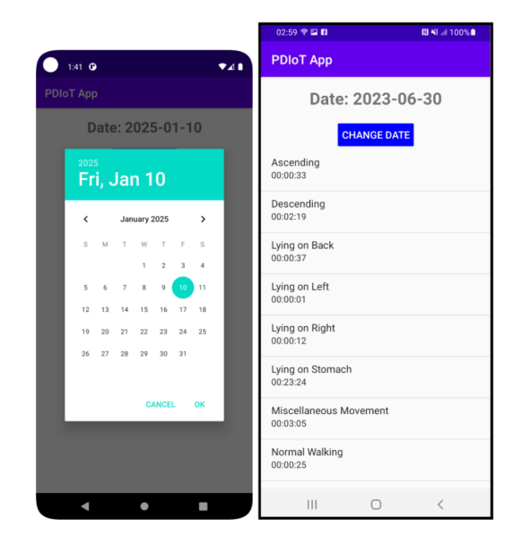

# PDIOT App

This application is part of the IoT system developed for the PDIOT course. It integrates sensor data with user interactions, machine learning models, historical activity data, and the overall system functionality.

---

## Setup

1. **Open the PDIOT App**  
   Upon launching the app, you will be greeted with the home page.

   

2. **Connect Sensors**  
   - Click on **Connect Sensors**.  
   - Scan the QR code of the Respeck and Thingy sensors or manually enter the code.  
   - Ensure Bluetooth is enabled and the sensors are turned on.  

3. **Place Sensors**  
   - Refer to the image below for proper placement of the sensors:

     

     - **Thingy Sensor**: Place it in your right-hand pocket, with the charging port facing downward and the circular marker on the top right.  
     - **Respeck Sensor**: Stick it to the lower left part of your ribcage, ensuring the blue side faces your skin and the "Respeck" text is oriented upwards.  

---

## Usage

1. **Live Processing**  
   - Once the sensors are connected, return to the home page and click on **Watch Live Processing**.  
   - The app will display live sensor data with real-time graphs.  
   - Perform any of the actions, and you will see classification labels for activities and social signals.

   

   - The app can classify the following tasks:

     **Social Signals** (Performed during stationary activities):  
     1. Breathing normally  
     2. Coughing  
     3. Hyperventilating  
     4. Other (talking, eating, singing, and laughing)  

     **Daily Activities**:
     1. Sitting and Standing  
     2. Lying on the left side  
     3. Lying on the right side  
     4. Lying on the back  
     5. Lying on the stomach  
     6. Walking normally  
     7. Running/Jogging  
     8. Ascending stairs  
     9. Descending stairs  
     10. Shuffle-walking  
     11. Miscellaneous movements

2. **View Historical Data**  
   - To review past activity classifications, return to the home page and click on **View Activity History**.  
   - The app will display the durations of each activity you performed.

   
